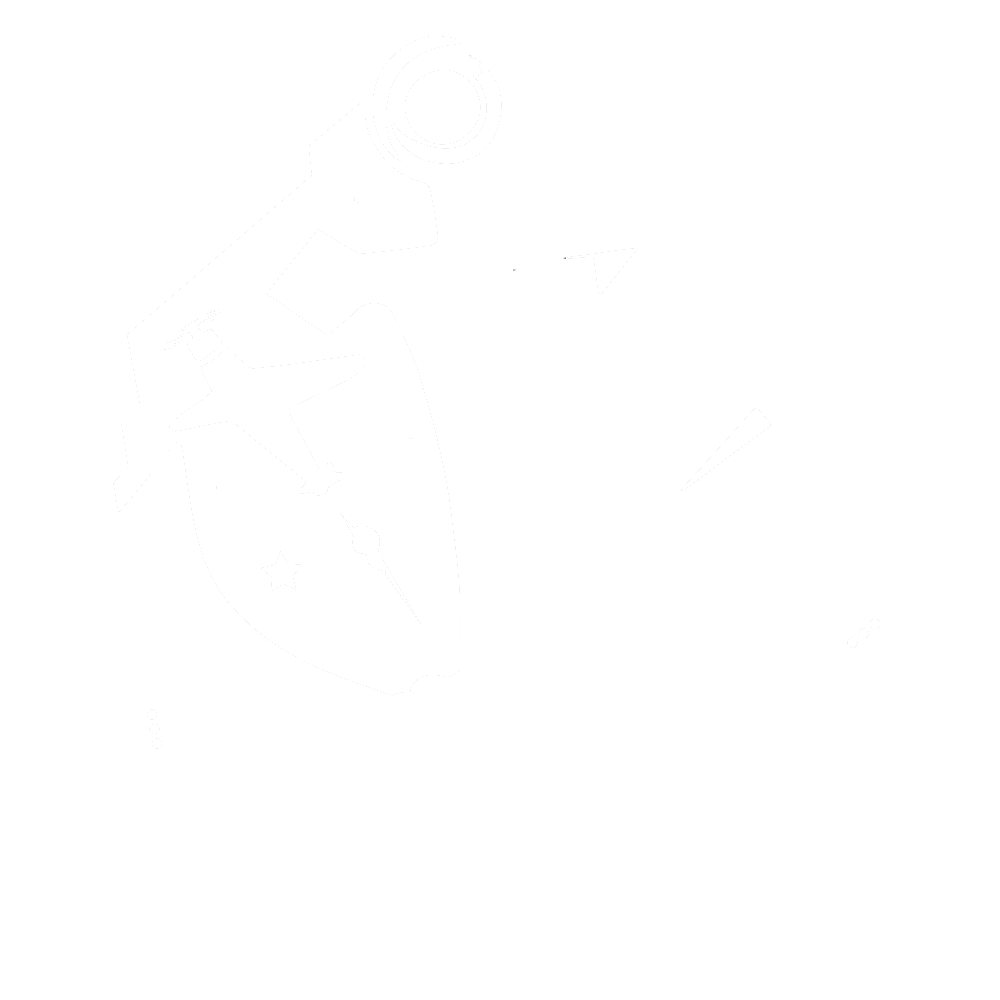

  

# Nimi

Welcome aboard! Nimi is the unofficial API that returns JSON data from [Azur Lane](https://azurlane.yo-star.com/) and is always updated to the latest game version. Things have changed since you stopped since you last checked the API! We're now using a serverless approach for writing the new version, there might be some bugs and of course, we change some stuff really fast so beware of maelstroms and icebergs, Captain!

### Compared to previous version

Due to the stateless architecture of the new API, we are able to reach more audiences much more better than before. And thanks to the new API's architecture and [Vercel](https://vercel.com?utm_source=azur-lane-api&utm_campaign=oss), the service is now accessible anywhere in the world, we're no longer isolated in one region! You're always 80ms or 160ms away from the service.

### What's next?

We're just getting started. We have a viewer coming up (and it's fully automated unlike the [Azur Lane Wiki](https://azurlane.koumakan.jp/Azur_Lane_Wiki)), and much more, so stay tuned! If you have any requests of your own, be sure to drop it by at the issues page.

### Motivation
There aren't many data providers for this mobile game, so we decided to make one for the community. These allows aspiring developers to help out the community and opportunities like Discord bots or self-hosted websites with tools and viewers.

Consider supporting our project as well so we can keep maintaining this project! A coffee a day gives us a happy day.

<i>
"Philosophy Sensei Z23" art by <a href="https://www.pixiv.net/en/users/26379226">しるこ</a> on <a href="https://www.pixiv.net/en/artworks/80256444">pixiv</a>
</i>

## Contributing

We are very open to contributions such as feature suggestions and pull requests! There are things to take note before doing so however.

Before you submit a pull request and to ensure you have a smooth time in  developing and improving the project, use [Visual Studio Code](https://code.visualstudio.com/) or any other editor that supports syntax highlighting and linting. Make sure to install the recommended extensions as well!

If you found something that isnt right, want to ask a question, or have a suggestion you'd like to be added, then please do make a new issue.

## Credits

 

 

 

Our project is powered by [Vercel](https://vercel.com?utm_source=azur-lane-api&utm_campaign=oss)! We host the project there and if you have a upcoming project, you should consider choosing Vercel as your host.

This API is Copyright &copy; Nathan Alo and Ayane Satomi. Licensed under GNU Affero General Public License. 

Contains code from [Aya](https://github.com/ClarityCafe/Aya). Aya's components are Copyright &copy; Ayane Satomi, Michael Mitchell, et al. Licensed under MIT.

Azur Lane, the game, and all its assets are Copyright &copy; Yostar. The developers and contributors are no way affiliated with the game, the company, nor its partners.

### Notes

While this project is open source under GNU General Public License, commercial use of this API is prohibited. This clause is non-negotiable.
